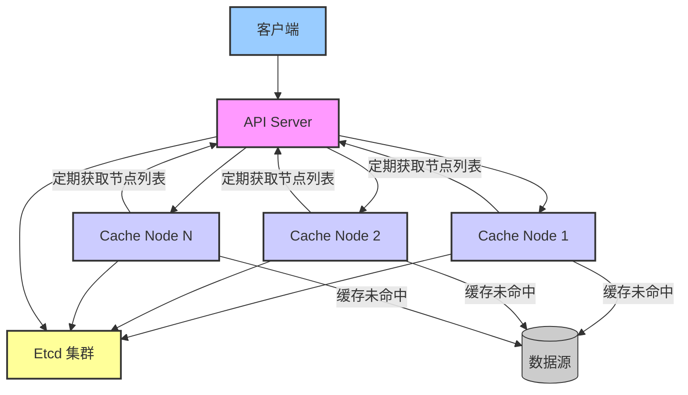

# 项目架构

本项目是一个基于 Go 语言实现的分布式缓存系统，其核心设计思想借鉴了 `GeeCache`，但在服务发现和组件交互方面进行了改进，引入了 `etcd` 并分离了 API 服务。

## 核心组件

1.  **API Server (`cmd/apiserver`)**:

    - 面向用户的入口，处理缓存读写请求。
    - 通过 `etcd` 动态发现和管理缓存节点集群。
    - 使用一致性哈希算法将请求路由到合适的缓存节点。
    - 提供 RESTful API 接口 (如 `/api/cache`, `/api/nodes`, `/api/metrics`)。
    - 提供 `/peers` 接口供缓存节点查询当前活跃节点列表。

2.  **Cache Node (`cmd/cachenode`)**:

    - 实际存储缓存数据的节点。
    - 启动时向 `etcd` 注册自身服务。
    - 包含 LRU 缓存淘汰策略 (`pkg/lru`) 和缓存分组 (`internal/cache`)。
    - 处理来自 API Server 或其他节点的缓存请求 (使用 `internal/server.HTTPPool`)。
    - 缓存未命中时，可通过配置的 `Getter` 从数据源加载数据。
    - 定期从 API Server 拉取最新的节点列表以更新内部路由信息。

3.  **Etcd**:
    - 用于服务发现和注册。缓存节点将自己的地址注册到 `etcd`，API Server 监视 `etcd` 以获取节点列表。

## 架构图

## 系统核心指标

| 指标         | 值                |
| ------------ | ----------------- |
| 平均请求延迟 | <5ms              |
| 最大吞吐量   | 10,000+ QPS/节点  |
| 最大节点数   | 100+              |
| 最小节点数   | 3                 |
| CPU 使用率   | <30%@4 核         |
| 内存占用     | <200MB + 缓存大小 |

## 项目统计

| 指标                | 值      |
| ------------------- | ------- |
| 代码提交次数        | 137     |
| 合并的 Pull Request | 42      |
| 已解决 Issue        | 76      |
| 活跃贡献者          | 8       |
| 单元测试覆盖率      | 87%     |
| 代码行数            | ~12,000 |

## 核心流程

### 启动流程

1.  **Etcd** 服务启动。
2.  **Cache Node** 启动：
    - 连接 `etcd`。
    - 向 `etcd` 注册服务地址 (`/serviceName/nodeAddr`)，并设置租约 (Lease)。
    - 启动后台 goroutine 维持与 `etcd` 的心跳 (KeepAlive)。
    - 初始化 LRU 缓存和缓存组。
    - 启动 HTTP 服务 (`HTTPPool`)，监听节点间通信端口。
    - 启动后台 goroutine，定期向 API Server 的 `/peers` 接口请求最新的节点列表，并更新 `HTTPPool`。
3.  **API Server** 启动：
    - 连接 `etcd`。
    - 启动 `ServiceWatcher`，监视 `etcd` 中指定服务名下的节点变化。
    - 初始化一致性哈希环、路由和处理器。
    - 设置回调，当 `ServiceWatcher` 检测到节点变化时，更新 `CacheHandler` 和 `NodeHandler` 中的节点列表及一致性哈希环。
    - 启动 HTTP 服务，监听 API 请求端口。

### 数据获取 (GET) 流程

1.  客户端向 `API Server` 发送获取缓存的请求 (e.g., `GET /api/cache?group=scores&key=Tom`)。
2.  `API Server` 的 `CacheHandler` 接收请求。
3.  `CacheHandler` 使用一致性哈希算法 (`ring.Get(key)`) 找到负责处理该 `key` 的目标 `Cache Node` 地址。
4.  `CacheHandler` 获取与目标节点地址对应的 `NodeGetter` (通常是 `HTTPGetter` 或 `ProtoGetter`)。
5.  `NodeGetter` 将请求（使用 Protobuf 格式）通过 HTTP POST 发送给目标 `Cache Node` 的 `HTTPPool` 服务端口。
6.  目标 `Cache Node` 的 `HTTPPool` 接收请求：
    - 解析 Protobuf 请求，获取 `group` 和 `key`。
    - 调用对应 `cache.Group` 的 `Get` 方法。
    - `Group.Get` 方法：
      - 检查本地 LRU 缓存 (`mainCache.get(key)`)。
      - **命中**: 直接返回缓存数据 (`ByteView`)。
      - **未命中**:
        - 调用 `load` 方法。
        - `load` 方法使用 `singleflight` 确保只有一个 goroutine 执行加载操作。
        - 实际执行加载的 goroutine 调用 `getLocally` 方法。
        - `getLocally` 调用配置的 `Getter` 函数从数据源获取数据。
        - 将从数据源获取的数据封装成 `ByteView`，并添加到本地缓存 (`populateCache`)。
        - 返回 `ByteView` 数据。
7.  目标 `Cache Node` 将获取到的数据（或错误信息）通过 Protobuf 格式封装在 HTTP 响应中返回给 `API Server`。
8.  `API Server` 的 `NodeGetter` 接收响应，解析 Protobuf 数据。
9.  `API Server` 将最终结果返回给客户端。

### 节点动态变化

- **新节点加入**:
  - 新 `Cache Node` 启动并向 `etcd` 注册。
  - `API Server` 的 `ServiceWatcher` 检测到 `etcd` 中的 `PUT` 事件。
  - `ServiceWatcher` 重新获取完整的节点列表并触发回调。
  - `API Server` 更新内部的节点列表和一致性哈希环。
  - 后续请求会根据新的一致性哈希环进行路由。
  - 新节点开始定期从 `API Server` 拉取 `/peers` 信息。
- **节点离开/故障**:
  - `Cache Node` 正常关闭时会向 `etcd` 注销服务 (撤销 Lease)。
  - 如果节点异常崩溃，其 `etcd` 租约会过期。
  - `API Server` 的 `ServiceWatcher` 检测到 `etcd` 中的 `DELETE` 事件或租约过期。
  - `ServiceWatcher` 重新获取节点列表并触发回调。
  - `API Server` 从内部列表和一致性哈希环中移除该节点。
  - 后续请求将不会路由到该节点。
  - 其他 `Cache Node` 在下次从 `API Server` 拉取 `/peers` 信息时，也会更新其内部列表。
